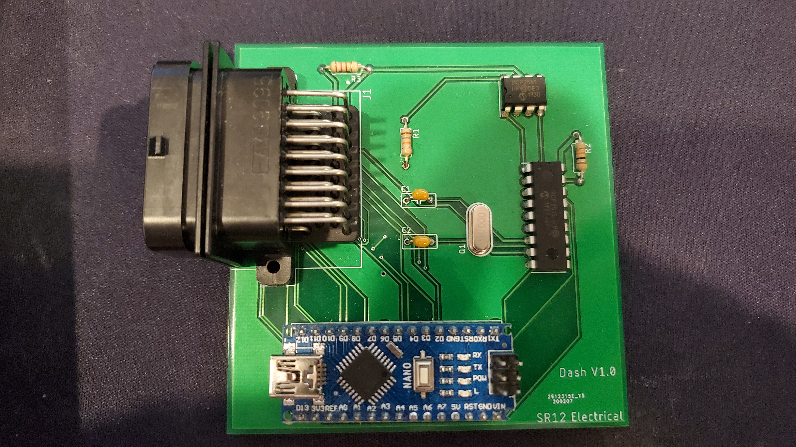

# Dashboard Controller Module
 

 ## Folder Structure

1. [Dash Controller Code](./DashControllerCode) (contain the Dash controller code for arduino IDE)
2. [Documentation](./Documentation) (All documents pertinent to the controller module)
3. [Libraries Used](./LibrariesUsed) (contain all arduino IDE libraries required by the controller)

 ## Board File
 
  
  
 
 