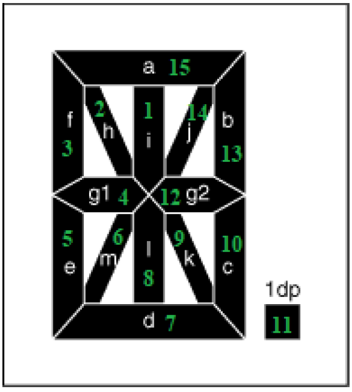
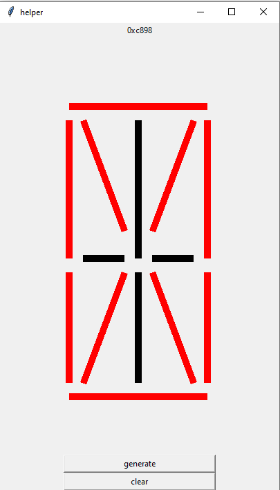
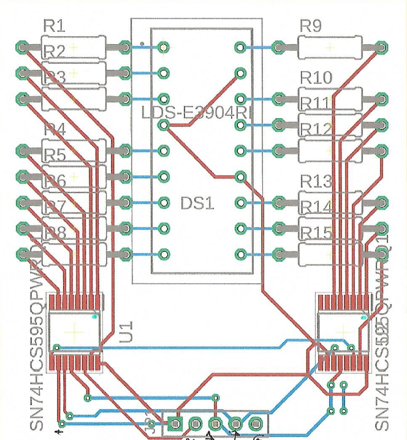

# Gear Position Module
  

 
 ## Folder Structure
 
 1. [Arduino Library](./ArduinoLibrary) (contain the gear position library code for arduino IDE)
 2. [Character Value Generator](./CharacterValueGenerator) (contain a [python program](#character-value-generator) that auto generates the hexadecimal value for a specific character)
 3. [Documentation](./Documentation) (All documents pertinent to the gear module)
 
 ## Segment Numbers
 
  

 ## Character Value Generator
 You can use this python program to find the hexadecimal code for your own character. You can design any character that you wish to display and add that special design to the [library](./ArduinoLibrary).
 
 
 
 ## Board File
 
  
 