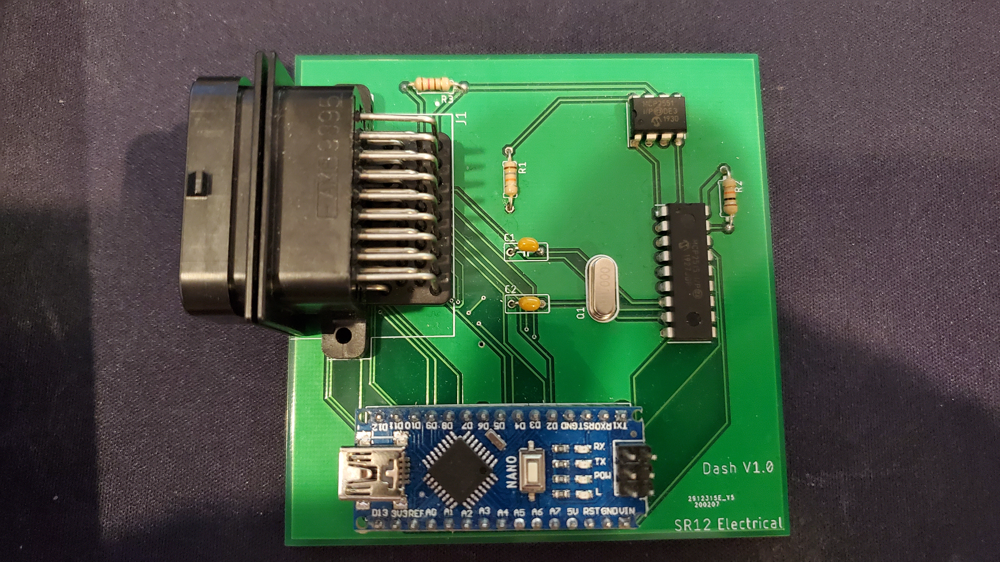
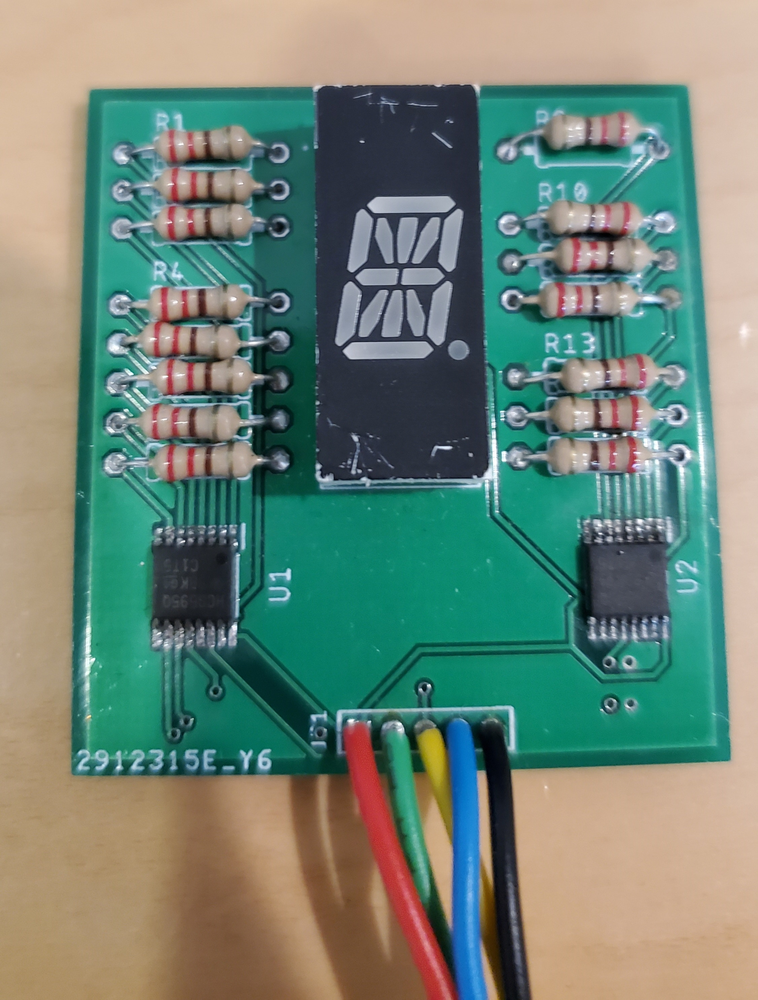

# Formula SAE Dashboard
This repository contains all design files and hardware documentation for the dashboard.
## Description

The dashboard integrates with the car via Controller Area Network (CAN) protocol. 
The information from the car gets processed through the [Dashboard Controller Module](./DashboardController/readme.md) which controls all the actuators.
We use an RGB LED strip for engine RPM, and [Gear Position Module](./GearPositionModule/readme.md) for the displaying current gear position. 

## Hardware
### Controller:

### Gear module

 

